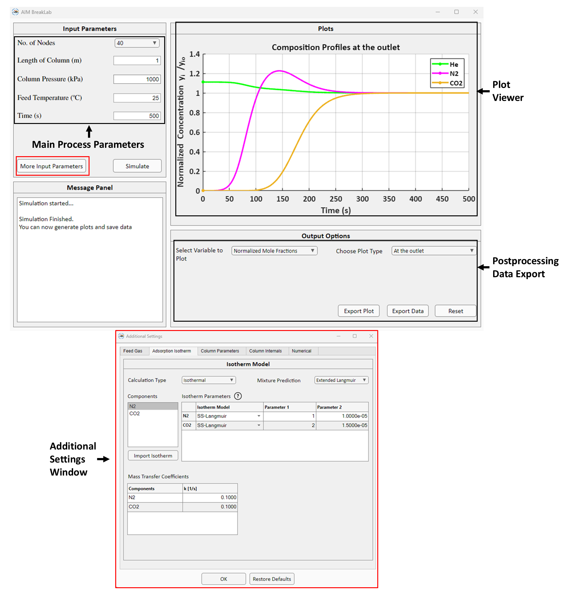

.. AIM Documentation documentation master file, created by
   sphinx-quickstart on Fri May 16 14:38:34 2025.
   You can adapt this file completely to your liking, but it should at least
   contain the root `toctree` directive.

BreakLab
===============================

**BreakLab** is the module for isothermal/non-isothermal multicomponent fixed bed breakthrough simulation for up to 5 components.
**BreakLab** GUI  is shown below:  
 

   
-------

The isotherm fitting results from **IsoFit** and **HeatFit** for different components can be directly loaded into **BreakLab** module.

Watch how to use **BreakLab** :ref:`here <BreakLab-label>`

The mathematical model implemented in BreakLab and the required properties and parameters for breakthrough simulation are summarised below.

Mathematical Model
---------------------------------------------

The mathematical model of BreakLab is based on the following assumptions:

* The gas flow is axially dispersed and charecterized by an axial dispersion coefficient.
* The gas phase is ideal.
* Pressure drop in the column is given by Ergun's equation.
* The steady state momentum balance is applicable.
* The adsorbent bed is uniform; the bed density, void fraction, and particle size are constant throughout the bed length.
* Thermal equilibrium exists between gas and solid phase.
* The heat transfer coefficient governing the heat transfer between column wall and bed is constant.
* The wall temperature remains constant.
* The mass transfer resistance between solid and gas phase is governed by Linear Driving Force (LDF) model.
* The concentration, pressure, and temperature gradients in the axial directions are negligible.

The material, energy and momentum balances are developed based on conservation of mass, energy, and momentum in the fixed bed, respectively.
These balance equations consist of mole conservation of component :math:`i`, overall mass balance, conservation of total momentum and the total energy
of the system. The balance equations are summarised in table below. Please check the journal article for a more detailed discussion on deriving these 
forms of balance equations.

.. list-table:: BreakLab Balance Equations
   :header-rows: 1
   :widths: auto

   * - 
     - Expression
   * - Component mole balance
     - :math:`\varepsilon_{t}\left(\frac{\partial y_{i}}{\partial t} + \frac{y_{i}}{P}\frac{\partial P}{\partial t} - \frac{y_{i}}{T}\frac{\partial T}{\partial t} \right) = D_{ax} \frac{\varepsilon_{b} T}{P}\frac{\partial}{\partial z} \left(\frac{P}{T} \frac{\partial y_{i}}{\partial z}\right) - \frac{\varepsilon_{b} T}{P}\frac{\partial}{\partial z} \left(\frac{y_{i}vP}{T}\right) - \frac{\rho_{b,ads}RT}{P} \frac{\partial q_{i}}{\partial t}`
   * - Total mole balance
     - :math:`\frac{\partial P}{\partial t} = \frac{P}{T}\frac{\partial T}{\partial t} - \frac{\varepsilon_{b} T}{\varepsilon_{t}}\frac{\partial}{\partial z} \left(\frac{vP}{T}\right) - \frac{\rho_{b,ads}RT}{\varepsilon_{t}} \sum_{i\in I} \frac{\partial q_{i}}{\partial t}`
   * - Energy Balance
     - :math:`\left(\rho_{b,ads}C_{p,ads} + \rho_{b,ads}C_{p,a}\sum_{i \in I} q_{i}\right)\frac{\partial T}{\partial t} = K_{z} \frac{\partial^{2}T}{\partial z^2} - \frac{C_{p,gas}\varepsilon_{b}}{R}\frac{\partial}{\partial z}(vP) + \rho_{b,ads} \left( \sum_{i \in I} \left(-\Delta H_{ads,i}\frac{\partial q_{i}}{\partial t}\right) - C_{p, a}T \sum_{i \in I}\frac{\partial q_{i}}{\partial t}\right) - \frac{2 h_{in}}{r_{in}} (T - T_{wall}) - \frac{C_{p,gas}\varepsilon_{t}}{R}\frac{\partial P}{\partial t}`
   * - Linear Driving Force
     - :math:`\frac{\partial q}{\partial t} = k_{i}(q_{i}^{*} - q_{i})`
   * - Ergun Equations
     - :math:`- \frac{\partial P}{\partial z} = \left(\frac{150 \mu}{4r_{p}^{2}}\right) \left(\frac{1-\varepsilon_{b}}{\varepsilon_{b}}\right)^2v + \left(\frac{1.75 \rho_{gas}}{2r_{p}} \left(\frac{1-\varepsilon_{b}}{\varepsilon_{b}}\right) \right)v^{2}` 

Boundary Conditions
~~~~~~~~~~~~~~~~~~~~

BreakLab uses the Danckwerts boundary conditions (BCs) for dispersed plug flow system. The BCs are summarised in table below.

.. list-table:: BreakLab Boundary Conditions
   :header-rows: 1
   :widths: auto

   * - 
     - Inlet (:math:`z = 0`)
     - Outlet (:math:`z = L`)
   * - Mole fraction (:math:`y_{i}`)
     - :math:`D_{ax} \frac{\partial y_{i}}{\partial z}|_{z=0} = -v|_{z=0}(y_{i, 0} - y_{i}|_{z=0})`
     - :math:`\frac{\partial y_{i}}{\partial z}|_{z=L} = 0`
   * - Temperature (:math:`T`)
     - :math:`K_{z} \frac{\partial T}{\partial z}|_{z=0} = -\varepsilon_{b}\rho_{gas}C_{p, gas}v|_{z=0}(T_{0} - T|_{z=0})`
     - :math:`\frac{\partial T}{\partial z}|_{z=L} = 0`
   * - Velocity (:math:`v`)
     - :math:`v|_{z=0} = v_{0}/\varepsilon_{b}`
     - None
   * - Pressure (:math:`P`)
     - :math:`P|_{z=0} = f^*(v_{0})`
     - :math:`P|_{z=L} = P_{0}`

\* here :math:`f` represents the Ergun equation. Only the velocity is specified at inlet and pressure is back calculated using Ergun equation.

Together the balance equations and BCs consitute the mathematical model of BreakLab.

.. math::
   \varepsilon_{t}\left(\frac{\partial y_{i}}{\partial t} + \frac{y_{i}}{P}\frac{\partial P}{\partial t} - \frac{y_{i}}{T}\frac{\partial T}{\partial t} \right)
    = D_{ax} \frac{\varepsilon_{b} T}{P}\frac{\partial}{\partial z} \left(\frac{P}{T} \frac{\partial y_{i}}{\partial z}\right)
    - \frac{\varepsilon_{b} T}{P}\frac{\partial}{\partial z} \left(\frac{y_{i}vP}{T}\right)
    - \frac{\rho_{b,ads}RT}{P} \frac{\partial q_{i}}{\partial t}

.. math::
   \frac{\partial P}{\partial t} 
   = \frac{P}{T}\frac{\partial T}{\partial t}
   - \frac{\varepsilon_{b} T}{\varepsilon_{t}}\frac{\partial}{\partial z} \left(\frac{vP}{T}\right)
   - \frac{\rho_{b,ads}RT}{\varepsilon_{t}} \sum_{i\in I} \frac{\partial q_{i}}{\partial t}

.. math::
   \left(\rho_{b,ads}C_{p,ads} + \rho_{b,ads}C_{p,a}\sum_{i \in I} q_{i}\right)\frac{\partial T}{\partial t}
   = K_{z} \frac{\partial^{2}T}{\partial z^2} - \frac{C_{p,gas}\varepsilon_{b}}{R}\frac{\partial}{\partial z}(vP) \\
   + \rho_{b,ads} \left( \sum_{i \in I} \left(-\Delta H_{ads,i}\frac{\partial q_{i}}{\partial t}\right) - C_{p, a}T \sum_{i \in I}\frac{\partial q_{i}}{\partial t}\right)
   - \frac{2 h_{in}}{r_{in}} (T - T_{wall}) - \frac{C_{p,gas}\varepsilon_{t}}{R}\frac{\partial P}{\partial t}

.. math::
   - \frac{\partial P}{\partial z} = \left(\frac{150 \mu}{4r_{p}^{2}}\right) \left(\frac{1-\varepsilon_{b}}{\varepsilon_{b}}\right)^2v + \left(\frac{1.75 \rho_{gas}}{2r_{p}} \left(\frac{1-\varepsilon_{b}}{\varepsilon_{b}}\right) \right)v^{2}
  
.. math::
   \frac{\partial q}{\partial t} = k_{i}(q_{i}^{*} - q_{i}) 

